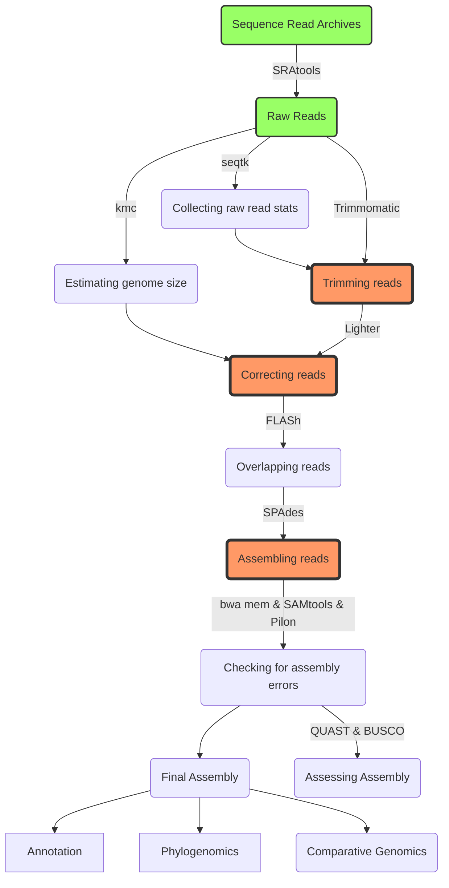

# MasterBioGeno
You will find here all the necesseray data to follow the tutorial on genome assembly
# Assembly workflow

# Assembly workflow cmd
### This workflow was inspired from shovill pipeline
````bash
# creat a project folder
mkdir assembly

#Get the raw data
prefetch SRR3111247

#converte sra file to fastq files
fasterq-dump -S -e 56 SRR3111247/SRR3111247.sra

#count the number of reads per file
cat SRR3111247_1.fastq | awk 'END { print NR/4}'

#calculate the average read length
cat SRR3111247_1.fastq | awk '{if(NR%4==2) { count++; bases += length} END{ print bases/count}' 

#Collecting raw read statistics with seqtk
seqtk fqchk \
-q3 /home/inra/CoursMasterGenobio/SRR3111247_1.fastq \
> 10-seqtk.tab

#Estimating genome size with kmc
kmc -m250 -sm -n256 -ci3 -k25\
 -t56 /home/inra/CoursMasterGenobio/SRR3111247_1.fastq kmc /tmp/u8mFd4Dcn5 >> 20-kmc.log 2>&1

#Trimming reads:
_JAVA_OPTIONS=-Xmx250g trimmomatic PE -threads 56 -phred33 /home/inra/CoursMasterGenobio/SRR3111247_1.fastq /home/inra/CoursMasterGenobio/SRR3111247_2.fastq R1.fq.gz /dev/null R2.fq.gz \
/dev/null ILLUMINACLIP:/home/inra/miniconda2/bin/../db/trimmomatic.fa:1:30:11 LEADING:3 TRAILING:3 MINLEN:30 TOPHRED33 >> 30-trimmomatic.log 2>&1

#Correcting reads with 'Lighter’
lighter -od . -r R1.fq.gz -r R2.fq.gz \ 
-K 32 4928359 -t 56 -maxcor 1 \
>> 40-lighter.log 2>&1

#Overlapping reads with 'FLASH’
flash -m 20 -M 100 -d . -o flash \
-z -t 56 R1.cor.fq.gz R2.cor.fq.gz >> 50-flash.log 2>&1

#Assembling reads with SPAdes
spades.py --pe1-1 flash.notCombined_1.fastq.gz --pe1-2 flash.notCombined_2.fastq.gz \
--s2 flash.extendedFrags.fastq.gz \
--only-assembler --threads 56 \
--memory 250 -o . --tmp-dir /tmp -k 21,29,37,45,53  >> /dev/null 2>&1

#Checking for assembly errors in contigs.fasta
#index the assembly
bwa index contigs.fasta >> 70-bwa.log 2>&1
#remap the reads on the assembly
bwa mem -v 3 -x intractg -t 56 \
contigs.fasta R1.fq.gz R2.fq.gz \
| samtools sort --threads 1 -m 125G \
--reference contigs.fasta -T /tmp/samtools.65534\
 -o aligned.bam >> 70-bwa.log 2>&1
#index the mapping
samtools index shovill.bam >> 70-bwa.log 2>&1
#Correcting errors in contigs.fasta
_JAVA_OPTIONS=-Xmx250g pilon --genome contigs.fasta \
--frags shovill.bam --fix bases --output pilon --threads 56 --changes --mindepth 0.25 >> 80-pilon.log 2>&1 >> /dev/null 2>&1

# to asses assembly with QUAST we nee a reference sequence:
#get the reference genome
wget -O Dickeya_solani_IPO2222.fna.gz https://ftp.ncbi.nlm.nih.gov/genomes/all/GCF/001/644/705/GCF_001644705.1_ASM164470v1/GCF_001644705.1_ASM164470v1_genomic.fna.gz && gunzip *.gz

# get the gff file
wget -O Dickeya_solani_IPO2222.gff.gz https://ftp.ncbi.nlm.nih.gov/genomes/all/GCF/001/644/705/GCF_001644705.1_ASM164470v1/GCF_001644705.1_ASM164470v1_genomic.gff.gz && gunzip *.gz

#runing the quast assesment
quast -r Dickeya_solani_IPO2222.fna -g Dickeya_solani_IPO2222.gff -o quastOUT outdir/contigs.fa
# runing busco
# liste first the lineage dataset available
busco --list-datasets

# run the command
busco -m genome -i outdir/contigs.fa -o buscoOUT -l enterobacterales_odb10

#now generate the plot of the result
python3 generate_plot.py -wd buscoOUT

````
