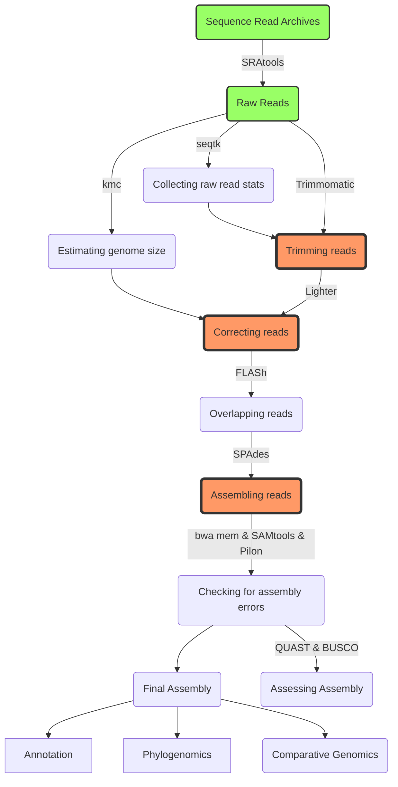

# How to use GitHub
## This is the Heading two
c'est project d'assemblage de génome bacterien

### this is heading 3
````bash
cp mon fichier target/dir
````

### this step is for trimming
````bash
code for trimming
````
## Diagram

